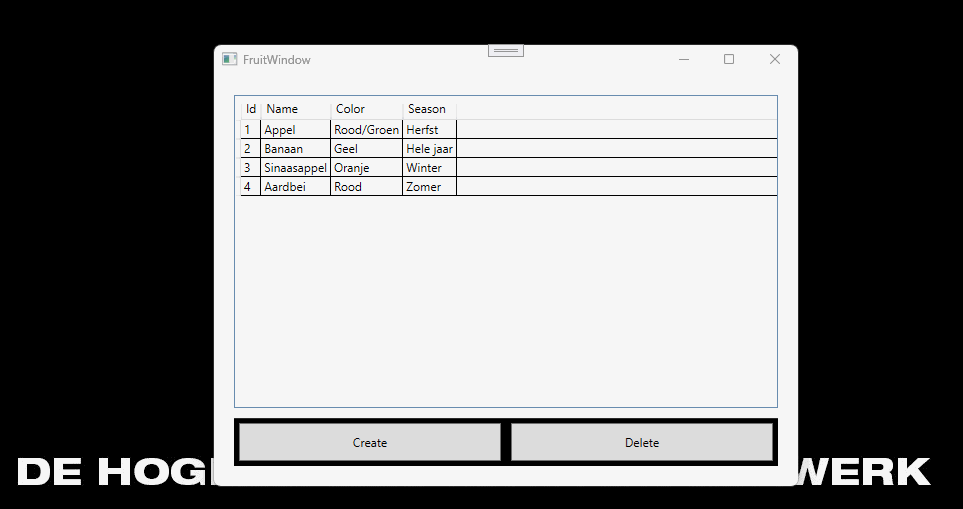

# ADO.NET connected 5 - De FruitShop



## Setup
### Database
- Maak een nieuwe database aan met de naam ```FruitDb``` (gebruik hiervoor SSMS)
- Gebruik de nieuwe database om onderstaande query uit te voeren:
```
CREATE TABLE Fruits(
	[Id] [int] PRIMARY KEY,
	[Name] [NVARCHAR](100) NOT NULL,
	[Color] [NVARCHAR](50) NOT NULL,
	[Season] [NVARCHAR](50) NOT NULL
);

INSERT INTO Fruits (Id, Name, Color, Season)
	VALUES
	(1, 'Appel', 'Rood/Groen', 'Herfst'),
	(2, 'Banaan', 'Geel', 'Hele jaar'),
	(3, 'Sinaasappel', 'Oranje', 'Winter'),
	(4, 'Aardbei', 'Rood', 'Zomer');
```
- Maak in het *Settings*-bestand een ConnectionString aan die verwijst naar de nieuwe database

### Projects
- Maak een link tussen de AppLogic class library en het UI project zodat de classes uit het AppLogic project gebruikt kunnen worden in het UI project
- Zorg ervoor dat het FruitWindow wordt getoond wanneer de applicatie gestart wordt

### Fruit
- Zorg dat de klasse *Fruit* de volgende eigenschappen heeft:
	- int : Id
	- string : Name
	- string : Color
	- string : Season

### Data
- Installeer het ```Microsoft.Data.SqlClient``` NuGet package in de AppLogic class library

## Vereisten
#### Startup
- Tijdens het laden van het FruitWindow moet de connectionstring uit het settings-bestand worden ingelezen. De waarde ervan wordt doorgegeven aan de ConnectionString eigenschap van de FruitData klasse
- Nadat de connectiestring is ingevuld moet de fruitDataGrid gevuld worden met de data uit de Fruit tabel van de database
	- Gebruik de ```FruitData.LoadAllFruits``` functie van de FruitData klasse om deze lijst (Data.Fruits) te vullen
	- Gebruik de lijst van Fruit objecten (FruitData.Fruits) als ItemsSource van de fruitDataGrid

#### Delete
- Wanneer er op de knop "Delete" geklikt wordt moet het (in de DataGrid) geselecteerde Fruit object verwijderd worden uit de lijst van Fruit objecten **EN** uit de database. Implementeer deze functionaliteit in de ```FruitData.DeleteFruit``` functie. Retourneer enkel *true* wanneer het record in de database ook effectief verwijderd werd.
- Refresh de fruitDataGrid om de gewijzigde lijst van objecten te tonen
> [!TIP]
> ```
> fruitDataGrid.Items.Refresh();
> ```

#### Create
- Wanneer er op de "Create"-knop geklikt wordt moet het CreateWindow modaal geopend worden
- Nadat de gebruiker de gegevens invult en op "Bewaren" klikt moet met de ```FruitData.CreateFruit``` functie aangeroepen worden.
	- Gebruik de FruitData.CreateFruit functie om de gegevens in de database te bewaren
	- Maak gebruik van de GetMaxId functie om een unieke Id te genereren 
	- Retourneer de toegevoegde gegevens als een nieuw Fruit object, inclusief het nieuwe Id
	- Voeg het nieuwe object ook toe aan de lijst van Fruit objecten (FruitData.Fruits) 
	- Het nieuwe Fruit object dat wordt geretourneerd door de CreateFruit functie moet worden bewaard en beschikbaar worden gemaakt voor andere classes via een readonly eigenschap ```CreatedFruit```
- Nadat het CreateWindow gesloten is moet de fruitDataGrid gerefreshed worden om de nieuwe gegevens te tonen, daarna moet het nieuwe Fruit object (dat zojuist werd aangemaakt) geselecteerd worden in de fruitDataGrid. Gebruik de *CreatedFruit* eigenschap van het CreateWindow om te bepalen welk object geselecteerd moet worden.
> [!TIP]
> ```
> fruitDataGrid.Items.Refresh();
> ```

